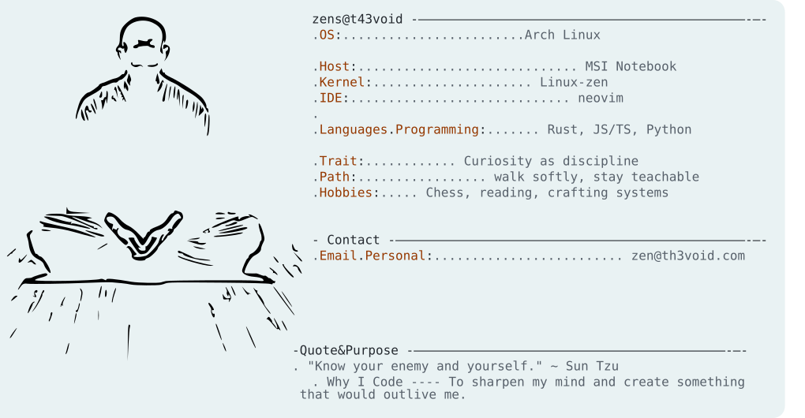

<a href="https://github.com/t43void/t43void">
  <picture>
    <source media="(prefers-color-scheme: dark)" srcset="./dark_mode.svg">
    
  </picture>
</a>
<!-- credits: https://github.com/Andrew6rant/Andrew6rant -->
